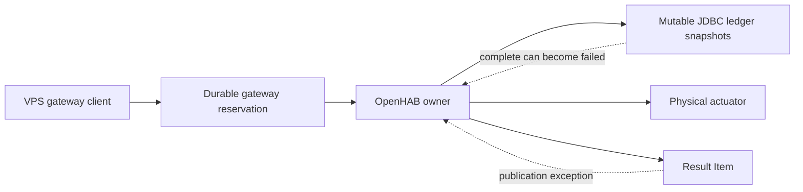
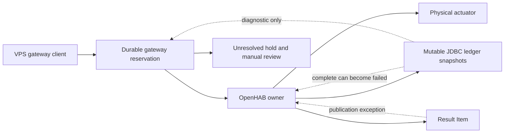
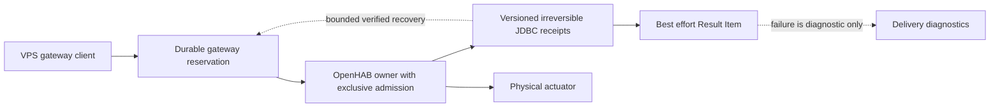

# Security Hardening Proposal: irreversible owner receipts

## Decision

We need an owner contract that permits lost-result recovery without interpreting
a transient persisted success as final. This proposal changes the existing
owner's internal state machine; it does not replace physical authority or enable
recovery in the shipped gateway.

## Executive Recommendation

The alternatives are **Option 1: retain unresolved hold with manual review** and
**Option 2: irreversible versioned receipts in the existing owner**. I recommend
preparing Option 2, while retaining Option 1 in deployment until its persistence
and concurrency contracts are demonstrated. No option proves food was dispensed:
completion remains a confirmation of the owner control sequence.

## Evidence

I read `runFeederOwner`, `writeLedger`, the timer callback and `safeResult` in the
operator-exported rule. The strongest evidence is that persistence and result
publication share a catch block that writes a different terminal state.

| Evidence | Finding or document | What it establishes |
| --- | --- | --- |
| owner-source | Exported rule 88bd9ec4de, SHA256 730053e0f3245cb83461e3fe6e3b05d49c8b508631e8cdb4a889c8be8d915978 | Observed source: ledger read precedes busy acquisition; complete persistence can precede a failed correction |
| jdbc-evidence | `docs/security/openhab-jdbc-recovery-evidence.md` at d04fcffee9f3f6db4ba9ee21dbd59ecc8546833d | Four sanitized existing snapshots establish response shape, not history coverage or finality |
| gateway-contract | `docs/security/openhab-owner-contract.md` at the same revision | Existing typed outcomes, permanent unresolved reservations and version-1 limitations |

The raw source remains private; its relevant boundaries are described in the
repository documents above. We infer from the observed source that a reader
can race a paused completion callback. No live race or physical test was run.

## Current Design And Failure Mode

The authenticated gateway sends a UUID request to the owner. The owner reads a
bounded ledger before claiming its shared busy token. A concurrent invocation can
therefore retain a stale snapshot while another invocation finishes. Inside the
timer callback, OFF and counter checks precede complete persistence, but readback
or result publication failure subsequently writes failed/execution_error. If that
correction also fails, history can retain only the apparent success.

We cannot resolve this with two matching snapshots, a longer delay or a successor
entry. Those observations do not establish that the first callback has finished
or that the successor read current state. The gateway's permanent reservation
contains the current risk by refusing a new physical request while unresolved.
The structural issue is that durable actuation outcome and delivery health share
one mutable authority record.

## Desired Invariants

- Every invocation that can actuate, including any retained legacy entry, claims
  the same exclusive owner before reading or changing admission state.
- An accepted UUID is durably recorded before ON. An uncertain accepted write
  never authorizes ON and never authorizes automatic replay of that UUID.
- A complete receipt can be written only after the required OFF command and
  counter readback have succeeded. It is never downgraded or overwritten.
- Delivery failure changes diagnostics, not actuation outcome. A missing receipt
  remains unresolved; absence is never proof of no action.
- Restart, corrupt/missing restore, unknown versions and ambiguous persistence
  preserve a hold. Gateway records never expire with the bounded owner ledger.

## Constraints And Non-Goals

We preserve the existing actuator, one-second expire backstop, cooldown, request
freshness and limits. We do not redefine software counter success as a physical
sensor measurement. The proposal does not authorize changes to feeder enablement,
OpenHAB credentials or home firewall. New generic REST access from the VPS is
out of scope. Version-1 receipts cannot be retrospectively promoted to final.

## Before Architecture

The result-delivery edge currently feeds back into the authoritative ledger.
That edge is what makes a stored complete observation unsafe for recovery.

## Options

### Option 1: retain unresolved hold with manual review

We can keep the current owner and treat JDBC solely as diagnostic evidence. This
has the smallest deployment risk and preserves the current no-resend behavior.
It is a reasonable permanent choice when missed notifications are sufficiently
rare and a qualified operator can adjudicate them without guessing from counters.

Its availability cost is direct: a lost completion can stop subsequent feeding
until review. Manual review must correlate the original UUID and authoritative
observations; it cannot be a button that blindly clears reservations. We would
add an audited reconciliation procedure only after defining its evidence and
operator authority. No new process, queue or database is needed. Rollback from a
future reader is to disable that reader and retain all existing reservation rows,
not erase history or resend old commands.

| Change | Before | After | Security consequence | Cost |
| --- | --- | --- | --- | --- |
| Recovery authority | Unresolved result | Explicit diagnostic-only history | No speculative release | Manual intervention and blocked capacity |

We gain clarity rather than a new recovery capability. The source defect remains,
but the gateway does not rely on the defective finality property.

### Option 2: irreversible versioned receipts in the existing owner

We can retain the current rule and actuator while splitting three responsibilities:
exclusive admission, actuation outcome, and result delivery. The owner must claim
an actually atomic lock before ledger restore/read, duplicate lookup, interrupted
request handling and cooldown calculation. Time must be refreshed under that
ownership. The asynchronous timer keeps ownership through outcome handling;
every release path verifies the invocation token. We must verify the real Java
cache/locking semantics rather than assuming a JavaScript mock proves atomicity.

For a proposed `feeder-request-ledger/v2`, accepted persistence and its readback
remain prerequisites for ON. Once OFF and counter readback succeed, the owner
constructs one immutable complete receipt. Persisting it may return success,
fail, or leave the result uncertain. In all three cases we never replace that
candidate with a failed receipt: the control-sequence outcome no longer changes.
We publish complete only after matching durable readback; otherwise we preserve
an unresolved delivery/persistence diagnostic and let a later reader establish
whether the exact complete receipt exists. Repeated persistence attempts, if
supported, write exactly the same receipt and never repeat ON or increment the
counter. Pre-completion actuation errors remain failed/ambiguous, never no-action.

This distinguishes two facts that the existing catch block conflates. A lost
notification is compatible with a final completed operation. A database timeout
is not proof either way. We can acknowledge a later exact durable v2 receipt
because its schema contract forbids a later downgrade, not because we waited
long enough. An uncertain persistence state must also prevent new owner admission
until authoritative state is restored; releasing a volatile busy token is not
permission to accept another physical request. Across restarts, missing or
conflicting restore retains the hold.

We need an explicit v2 wire discriminator for result/recovery authority. The
existing gateway rejects unknown fields and versions, so rollout must be staged
with compatible parsers that remain disabled until owner activation. We must
specify the exact JSON fields and bounded owner-local history query in the
implementation review; this proposal is not an invented live endpoint contract.
The reader belongs on the trusted gateway host, uses exact UUID/version matching,
disables synthetic persistence rows, and rejects incomplete pagination,
contradictory receipts and missing history. It must never scan backwards past a
failure to find success. Old v1 entries retain their old ambiguity even when
carried in a migrated snapshot; marking the enclosing ledger v2 cannot upgrade
an old receipt's provenance.

The main cost is availability during persistence trouble: ownership and the
unresolved hold can last longer. That is intentional, but we need bounded work,
observable diagnostics and a documented operator resolution path rather than an
unbounded polling callback. Memory remains limited by the existing ledger size
unless compatibility evidence justifies a separately reviewed retention change.
Locks serialize callers, so compare concurrent-request latency and timer delay
against the baseline. We should not promise unchanged latency without measuring
the real OpenHAB scheduler and JDBC implementation.

We introduce this through source-derived isolated tests, then a harmless owner
canary in the actual runtime. Rollback disables v2 recovery first and preserves
all v2 terminal receipts and gateway holds. Restoring an old rule that parses a
v2 ledger incorrectly is unsafe; either keep a compatibility reader with no
actuation or perform an explicitly reviewed migration while feeding is disabled.

| Change | Before | After | Security consequence | Cost |
| --- | --- | --- | --- | --- |
| Admission read | Before busy acquisition | Under exclusive ownership | Prevent stale-snapshot admission | Serialized reads and lock proof |
| Terminal receipt | Complete may become failed | Versioned irreversible outcome | Durable history can establish finality | Protocol migration and persistence proof |
| Notification failure | Rewrites outcome | Diagnostic-only | No delivery-driven downgrade | Separate observability |
| Recovery | Diagnostic history only | Exact verified v2 receipt | Lost notification can resolve without ON | Bounded trusted-side reader |

The new recovery edge depends on a proven receipt contract. If JDBC's actual
restore/persist semantics cannot support it, we should stay with Option 1 rather
than quietly substitute a cache read or introduce a new service authority.

## Comparison

All expected effects below are source-derived or hypothetical, not measured.

| Dimension | Option 1 | Option 2 | Confidence and validation |
| --- | --- | --- | --- |
| Security | Contains gateway release risk; owner defect remains | Removes downgrade/stale-read paths if contract holds | Medium, source-derived; replay original race under controlled pauses |
| Performance | Existing fast path; potentially indefinite hold | Adds serialized read and bounded verification work | Low, hypothetical; measure p50/p99 admission and timer jitter |
| Memory | Existing bounded ledger | Same bounds plus separate bounded diagnostics | Medium, source-derived; test max ledger, measure peak heap |
| Reliability | Manual recovery after lost results | Autonomous exact-receipt recovery; persistence outages still hold | Medium, source-derived; restart and DB failure matrix |
| Operability | Frequent operator adjudication if delivery unreliable | Version-aware diagnostics and migration procedure | Medium, hypothetical; rehearse on-call reconciliation |
| Migration | No wire change | V1/v2 coexistence and rollback guard needed | High, source-derived; fixtures and mixed-version tests |
| Developer ergonomics | Simple but manual policy can drift | Explicit transition API prevents catch-block downgrade | Medium, source-derived; review every terminal writer |
| Reversibility | Already deployed safety posture | Disable reader, preserve receipts; old-rule rollback gated | High, source-derived; restore rehearsal with unresolved UUID |

The strongest reason to prefer Option 2 is recoverability without replay. The
strongest reason to postpone it is an unproven durability or locking primitive,
not the size of the parser change.

## Recommendation

I recommend Option 2 under the existing-owner constraint, with Option 1 retained
until the actual runtime tests pass. We should revisit this if owner-local JDBC
cannot establish authoritative readback or if the bounded history loses receipts
before the required recovery window. A new transactional owner service would be
a separate authority redesign, not a hidden implementation detail of this option.

## Evidence Coverage And Residual Risk

| Evidence | Option 1 | Option 2 | Tactical protection retained |
| --- | --- | --- | --- |
| owner-source — pre-lock reads and mutable terminal outcome | Mitigates gateway consequence only | Addresses proposed owner paths | Permanent unresolved gateway reservation |
| jdbc-evidence — incomplete history and transient complete rows | Diagnostic only | Mitigates with versioned bounded reader; v1 unaffected | No inference from absent/truncated history |
| gateway-contract — typed correlated outcome boundary | Preserved | Requires compatible discriminator; authority unchanged until rollout | Same UUID polling and no resend |

Physical device failure, external actuator commands, independent counter writes,
JDBC data loss and administrative compromise remain risks. This proposal closes
none of those through a software receipt. No finding is marked resolved here.

## Migration And Rollout

Pin and recheck the exact live rule digest before implementation. Prepare compatible
schema and parser changes without enabling recovery. Exercise an isolated real
OpenHAB runtime with harmless actuator Items and the actual persistence provider.
Only then request approval for a bounded home-host owner update with feeder
controls disabled, preserved backups and explicit rollback. Never migrate old
unresolved requests by synthesizing completed receipts.

## Validation Plan

The critical boundary remains real daemon -> real gateway -> harmless mock
OpenHAB, with command counts. Add owner-runtime tests because a JSON fixture
cannot prove Java lock or JDBC behavior. Pause after complete persistence; inject
readback timeout and result publication failure; resume and confirm the complete
receipt cannot downgrade. Exercise failed correction persistence as the original
negative control. Run distinct UUID concurrency, duplicate UUID replay, restart
before/after ON, missing restore, partial history, old v1 rows and DB failures.

For each case assert ON counts (zero before durable admission; at most one per
UUID), no speculative second UUID, and no counter re-increment during recovery.
With shipped settings prove seeded 2340 sats -> two separately confirmed feeds ->
340 sats. Record this as synthetic accounting and harmless actuation evidence.
Measure baseline/candidate admission latency, timer jitter and heap at maximum
ledger size and concurrent saturation; reject unbounded memory or polling and
review any deadline/cooldown violation rather than invent a performance target.

## Implementation Work Packages

After design selection, define exact v2 receipt and compatibility fixtures; prove
exclusive admission in the actual runtime; separate outcome persistence from
best-effort delivery; implement a bounded trusted-side recovery reader; extend
real-daemon/gateway and owner-runtime tests; prepare migration and rollback.
These are proposed work packages, not authorization to change the physical owner.

## Open Questions

Which actual OpenHAB primitive provides atomic ownership across rule/timer calls?
What does JDBC confirm on persist/readback and restore after process failure?
How long is v2 history retained, and how does a reader prove complete bounded
coverage? What exact version discriminator and compatibility representation will
be reviewed? Which diagnostic channel can report persistence uncertainty without
changing actuation authority? These are implementation evidence requirements,
not requests for production credentials or physical tests now.
